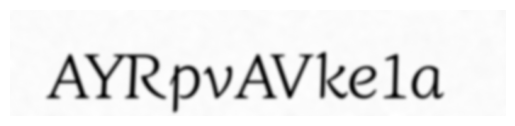
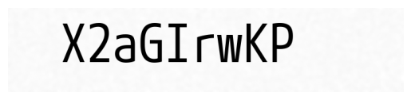

# Cant afford that font

is a **classifier for Google Fonts** that lets you input a image of a font that you found somewhere and predicts the top 4 most similar looking fonts on Google Fonts. The easiest way to use is through the Github hosted website [steilgedacht.github.io/cantaffordthatfont](https://steilgedacht.github.io/cantaffordthatfont/). The model is so small and lightweight, that it runs entirely in your browser without needing much computing power. 

The reason why I created it, is that as a graphic designer I like to use Google Fonts, but I already faced several times the issue that I found a font somewhere and wanted to have a similar one and had to scroll a long time through Google Fonts until I found a fitting one.

## Usage recommendation

The model works best with images that look like this, this are examples from the training dataset:

Nevertheless there is a additional image preprocessing before it is parsed to the model:
- the image is invereted based on if the background is darker as the text 
- the image is normalized to values between 0 and 255, meaning that the darkest pixel will be streched to pure black and the brightest pixel will be streched to pure white.

## Training

The training details can be found in train.py and the logged run is accessible under this [weights and biases](https://api.wandb.ai/links/steilgedacht/0t9z01pk) report.

## Known issues and Future developments

- The training clearly needs a lot more robustness. Currently the predictions are very well with the generated training data, but lacks behind for data like pasting in a quick screenshot of most fonts.
- Website features
  - dark mode option
  - design improvement
  - more explaination
  - etc.